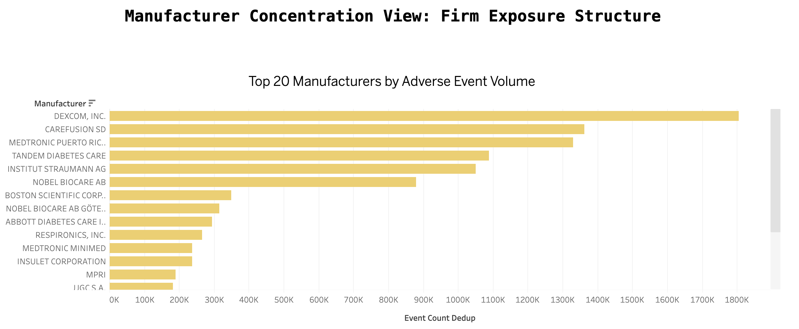

# U.S. Medical Device Regulatory Risk Intelligence Dashboard

An interactive business intelligence dashboard that integrates public FDA adverse event, recall, classification, and 510(k) clearance data to identify medical device categories, product codes, and manufacturers with higher observable post-market regulatory exposure.

<!-- TODO: Add dashboard screenshot after Tableau workbook is built -->
<!--  -->

## Business Questions

This dashboard helps answer:

- **Which device categories carry higher observable regulatory burden** in public FDA records?
- **Which product codes repeatedly show elevated** adverse event or recall exposure?
- **Which manufacturers appear more concentrated** in specific high-exposure categories?
- **After rough normalization by market-entry volume,** which categories still look unusually pressured?

## Dashboard Pages

| Page | Purpose |
|------|---------|
| **Executive Overview** | KPI cards, 2019-2025 trend lines, top panel rankings |
| **Category & Product Explorer** | Product code scatter plots, Pareto views, detail tables |
| **Manufacturer Concentration** | Top firms by category, concentration analysis, firm profiles |
| **Methodology & Limitations** | Data sources, coverage stats, interpretation boundaries |

<!-- TODO: Add Tableau Public link after publishing -->
<!-- **[View the live dashboard on Tableau Public →](URL)** -->

## Data Sources

| Source | Role | Time Window |
|--------|------|-------------|
| [openFDA Device Adverse Events](https://open.fda.gov/apis/device/event/) | Primary post-market surveillance fact table | 2019-2025 |
| [openFDA Device Classification](https://open.fda.gov/apis/device/classification/) | Product code dimension and category hierarchy | Current |
| [openFDA Device Recall/Enforcement](https://open.fda.gov/apis/device/enforcement/) | Recall burden tracking | 2019-2025 |
| [openFDA Device 510(k)](https://open.fda.gov/apis/device/510k/) | Approximate market-entry denominator | 2019-2025 |

## Methodology

### KPI Framework

**Absolute metrics:** Deduplicated adverse event count, recall count, Class I recall count, death-related reports, serious injury reports.

**Normalized metrics:** Events per 100 clearances, recalls per 100 clearances, recall-to-event ratio. Minimum denominator thresholds applied (10 clearances) — categories below threshold show NULL, not zero.

**Structural metrics:** Severe recall share (Class I / total), firm share within product code, firm share within panel.

See [`docs/methodology.md`](docs/methodology.md) for full KPI definitions, data quality approach, and denominator caveats.

### Data Pipeline

The pipeline follows a lakehouse pattern:

```
Raw (JSON/CSV) → Clean (Parquet) → Mart (Parquet) → App (CSV for Tableau)
```

- **Raw:** Cached API responses and bulk file extracts
- **Clean:** Standardized, deduplicated, quality-controlled tables
- **Mart:** Business-ready aggregated tables at panel, product code, and manufacturer grains
- **App:** Pre-aggregated CSV extracts optimized for Tableau performance

## Key Findings

<!-- TODO: Populate after dashboard is built and data is analyzed. -->
<!-- Example findings: -->
<!-- - Panel X accounts for Y% of all adverse events despite representing only Z% of 510(k) clearances. -->
<!-- - The top 5 product codes by normalized event rate are ... -->
<!-- - Manufacturer concentration varies significantly: in some categories, a single firm accounts for >50% of events. -->

*Key findings will be populated after the dashboard is built and the data has been analyzed.*

## Key Limitations

1. **Not clinical risk.** This dashboard measures observable regulatory exposure in public records, not actual clinical safety. MAUDE is a passive surveillance system with known underreporting.
2. **No causality.** Adverse event reports reflect association, not causation.
3. **Denominator is approximate.** 510(k) clearance volume is a rough market-entry proxy, not installed base or patient exposure.
4. **Recall mapping is partial.** Not all recalls could be mapped to product codes. Only high-confidence mappings are included in default views.
5. **Partial year.** 2025 data may be incomplete depending on extraction date.

## Technology Stack

- **Python:** pandas, duckdb, pyarrow, requests, rapidfuzz, python-dotenv, tqdm
- **Visualization:** Tableau Public
- **Storage:** File-based (parquet/CSV) — no database server
- **Testing:** pytest (177+ tests), ruff (linting/formatting)

## Reproducibility

### Prerequisites

- Python 3.10+
- openFDA API key (optional but recommended — set in `.env`)

### Setup

```bash
python -m venv .venv
source .venv/bin/activate
pip install -r requirements.txt
cp .env.example .env  # Add your FDA_API_KEY
```

### Run the Pipeline

Execute notebooks in order:

1. `notebooks/01_source_validation.ipynb` — Validate API availability
2. `notebooks/02_data_extraction.ipynb` — Extract raw data from openFDA
3. `notebooks/03_event_cleaning.ipynb` — Clean and deduplicate adverse events
4. `notebooks/04_mapping_and_dimensions.ipynb` — Build dimensions, standardize manufacturers
5. `notebooks/05_metric_building.ipynb` — Construct mart tables and KPIs
6. `notebooks/06_dashboard_export.ipynb` — Export app CSVs for Tableau

### Run Tests

```bash
python -m pytest
python -m ruff check .
```

## Project Structure

```
├── data/
│   ├── raw/          # Cached API responses (JSON/CSV)
│   ├── clean/        # Standardized parquet files
│   ├── mart/         # Aggregated analytical tables
│   └── app/          # Dashboard-facing CSV exports
├── notebooks/        # Sequential pipeline notebooks (01-06)
├── src/
│   ├── api/          # openFDA API client
│   ├── extraction/   # Data extractors (4 sources)
│   ├── cleaning/     # Standardization and deduplication
│   ├── mapping/      # Cross-source alignment
│   ├── marts/        # Mart builders, KPIs, export
│   └── qa/           # Data quality governance
├── tableau/          # Tableau workbook and exports
├── docs/             # Methodology, data dictionary
└── tests/            # pytest test suite
```

## References

- [openFDA Device Adverse Event API](https://open.fda.gov/apis/device/event/)
- [openFDA Device Classification API](https://open.fda.gov/apis/device/classification/)
- [openFDA Device Recall/Enforcement API](https://open.fda.gov/apis/device/enforcement/)
- [openFDA Device 510(k) API](https://open.fda.gov/apis/device/510k/)
- [FDA MAUDE Data Files](https://www.fda.gov/medical-devices/medical-device-reporting-mdr-how-report-medical-device-problems/mdr-data-files)
